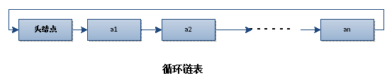
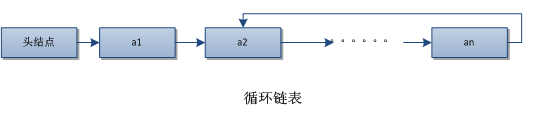
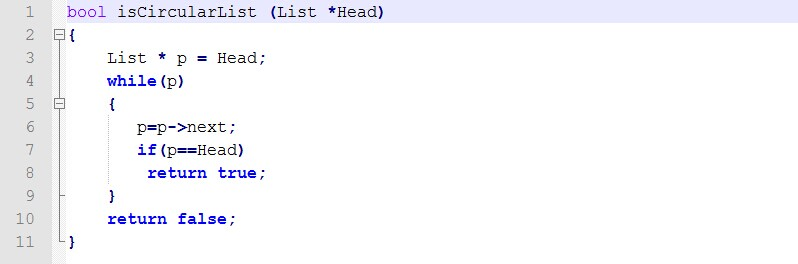
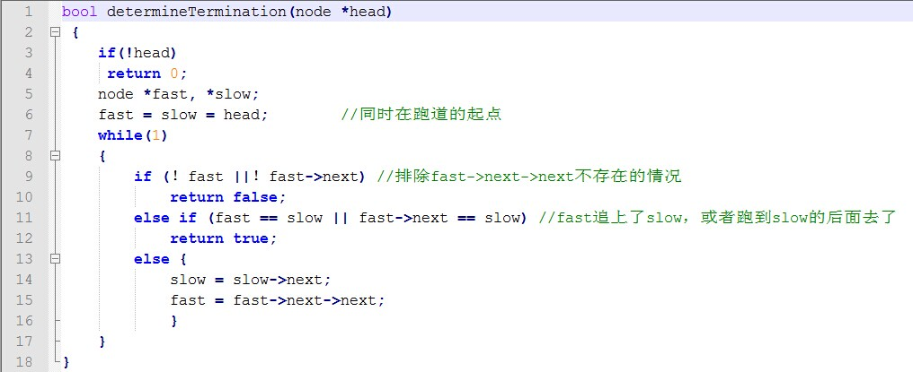

实际上判断一个链表是否是循环的思路很简单，困扰我的反而是“带环链表是否就是循环链表”这个问题，穿梭于各中帖子、书本寻找答案终究找不到明确说明。《大话数据结构》中循环链表的定义为：“将单链表中终端节点的指针端由空指针改为指向头结点，就使整个单链表形成一个环，这种头尾相接的单链表称为单循环链表，简称循环链表。”也就是这个样子的：

*

*

然后呢，还有其他带环链表是这个样子的：

*

*

暂时先把这两种情况的链表都称为循环链表吧（有些书籍就是这样处理的），那么下面就进入主题：

## 解法一

判断一个链表是否循环，那还不简单！只要判断有没有指向NULL的指针就好了嘛，如果没有指向NULL的指针，头结点又重复出现，那可定就是循环链表了！代码是这样的：

*

*

看起来太简单了是不是？？如果说是，那么你就错误了。这种判断方式只适合头尾相接的循环链表，像“6”形的循环链表会导致程序进入死循环。那么，还有啥子办法呢？当然是比较高大上的快慢指针啦：

快慢指针的思想：定义两个指向头结点的指针pfast ,pslow，让它们的步长不一样，比如pfast步长2n，pslow步长为1n。然后，就让它们同时从头结点开始遍历链表。如果链表是循环的，也即带有环的，那么快慢指针总有再相遇的时候。就像操场跑步，操场是个环，跑的快的同学总会再遇上跑的慢的同学。

那么，其实现方法是这样的：

*

*

这种方法的时间复杂度是O（n），空间复杂度是O（1）。且不会修改原来的链表。倘若不要求O（1）的空间复杂度，还有其他的解法，比如：

## 解法二

将所有的遍历过的节点用某个结构存储起来，然后每遍历一个节点，都在这个结构中查找是否遍历过，如果找到有重复，则说明该链表存在循环；如果直到遍历结束，则说明链表不存在循环。这个结构我们可以使用hash来做，hash中存储的值为节点的内存地址，这样查找的操作所需时间为O(1)，遍历操作需要O(n)，hash表的存储空间需要额外的O(n)。所以整个算法的时间复杂度为O(n)，空间复杂度为O(n)。

实际上还有其他很多方法，比如将原链表反向啊，构造双向链表啊等等。不过个人还是觉得快慢指针最好用。
